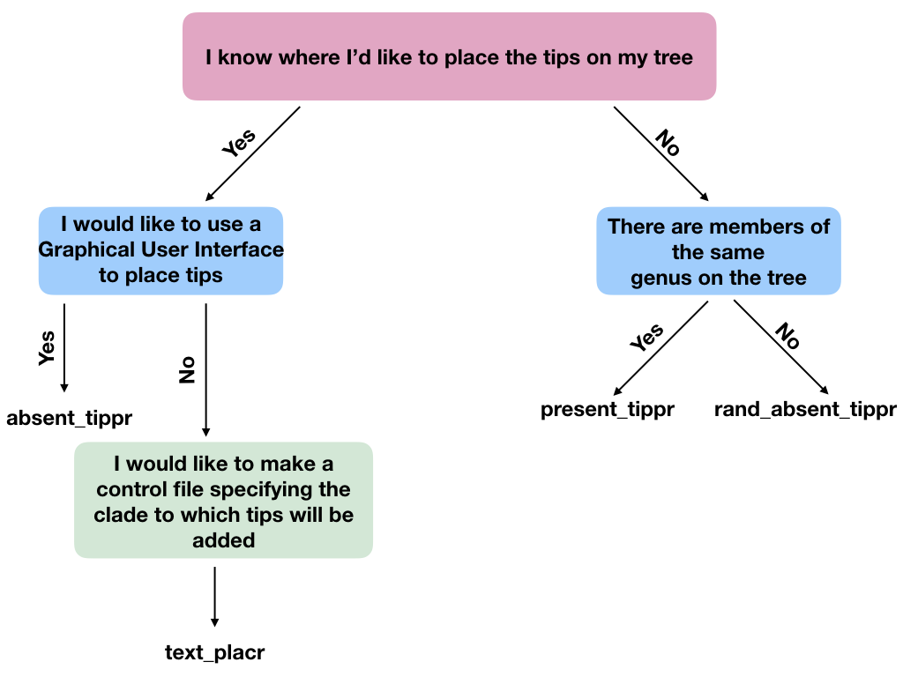

[](https://travis-ci.org/wrightaprilm/treeStartR)
[](https://codecov.io/gh/wrightaprilm/treeStartR)
[](https://github.com/ropensci/onboarding/issues/239)

## treeStartR

treeStartR is an R package for auomated generation of starting trees for total-evidence phylogenetic analyses. 

Phylogenetic trees, and particularly time-scaled phylogenetic trees, are 
increasingly estimated using parameter-rich models of evolution [@catmodel; @wright2016] and models incorporating macroevoloutionary processes [@fbd]. Finding a starting tree with a computable likelihood to perform a Bayesian MCMC under these complex models can be a challenge, particularly when when estimation involves many
taxa, large datasets, and missing data.

Different phylogenetic estimation packages allow users to find starting trees in different ways, such as estimating a tree under parsimony (@raxml8) or neighbor-joining [@beast2], randomly adding taxa to the tree [@beast2; @raxml8], or 
allowing the user to specify the tree. Addition of taxa is usually performed based on data - that is, using an algorithm (such as parsimony or neighbor-joining) to add the tips to the tree. However, in analyses of the fossil record, specimens may be included for which there are no molecular or morphological characters available, but the taxonomy of the specimen is known via expert opinion. This is the case with many specimens harvested via repositories such as the Paleobiology Database. 

The purpose of this package is to allow users to efficiently add taxa to a given tree to generate a reasonable starting tree. Functions in this package allow taxa to be added to a tree according to either their taxonomy (if other specimens from the same genus are present) in function `present_tippr`, at random (`rand_absent_tippr`), or via other user-specified groupings (`text_placr`). The package uses functions from 
phytools [@phytools] and ape [@ape].

## Installation

Install the development version directly from Github

```{r eval=FALSE}
library(devtools)
install_github("wrightaprilm/treeStartR")
```

## Usage Example

```{r}
library(treestartr)
data(bears)
```

First, we need to load a list of the total set of taxa present in the tree. The "total set" refers to any taxa that will be included in your analysis. This can be either a CSV or a TSV file. A sample list, bears, has been provided as part of the bears data object, but you can also generate one using the function dataf_parser. Note that if you have higher order taxa, for example, if you are placing a fossil that you have identified to family level, but not species level, these should be included as "family_spp." treeStartR relies on the underscore to separate between the higher order and lower order taxa. Use consistent formatting between the tree and taxon list - i.e, do not call a taxon "Ge_spp" on the tree and "Genus_spp" in the taxon list.

```{r}
tax_frame <- dataf_parsr(system.file("extdata/bears_taxa.tsv", package = "treestartr"))
```

Next, we find out which of the taxa from our total set are not represented on the tree already. This function takes as input a tree, with or without branch lengths, but without annotations (such as 95% HPDs). It also takes the total set of taxa generated by `dataf_parser`:

```{r warning=FALSE}
absent_list <- genera_strippr(tree, tax_frame)
```

## Adding tips with congeners

Finally, we add the tips that are not present to the tree. If there are other representatives of the same genera as an absent taxon (for example, adding an additional "Ursus" species to the example tree), those taxa will be used to place the tip. If there are multiple species of the genera, the new tip will subtend the most recent common ancestor of the tips already on the tree. If there is only one representative, the tip will subtend the parent node of that taxon.

```{r warning=FALSE}
new_tree <- present_tippr(tree, absent_list)
plot(new_tree)
```

After we have added our tips, we can check how many tips remain to be added, and which they are:

```{r warning=FALSE}
genera_strippr(new_tree, tax_frame)
```

## Adding tips manually

We can also add the tips that have no congeners. This function will ask for input. A pop-up will be produced, showing node labels. When the program asks for input, you will tell it what node you would like the tip to subtend. Alternatively, if you would like to place the tip as sister to a tip on the tree, enter the number of the tip. Tip numbers are highlighted in yellow.

```{r eval=FALSE}
new_tree <- absent_tippr(tree, absent_list)
```

## Adding tips at random
Or, if there are no congeners, you may choose to add tips at random:

```{r warning=FALSE}
new_tree <- rand_absent_tippr(tree, absent_list)
plot(new_tree)
```

Running the command again to generate a second random addition tree, and comparing it to the first using the RF distance [@Robinson1981], shows us that the tree topologies truly are different. 

```{r warning=FALSE}
second_random <- rand_absent_tippr(tree, absent_list)
phangorn::RF.dist(new_tree, second_random)
```

## Adding tips via CSV

Lastly, you may have a TSV file that specifies the tips to be added, and a taxon set. treeStartR will locate the MRCA of the taxon set, and add the tips subtending that node.

```{r warning=FALSE}
new_tree <- text_placr(tree, mrca_df)
plot(new_tree)
```

## Resolving polytomies

By default, treeStartR outputs trees with polytomies. This is because the placement of tips is not being estimated from data, but rather placed arbitrarily. RevBayes and BEAST2 read non-bifurcating trees. If you are working with analytical software that does not, you may want to resolve polytomies before export, such as with ape's `multi2di` [function](https://www.rdocumentation.org/packages/ape/versions/5.1/topics/multi2di):

```{r}
ape::multi2di(new_tree)
```

## Subtrees and Clade Constraints

All tip addition functions, except `absent_tippr` have the capability to write out [RevBayes-formatted](https://revbayes.github.io/tutorials/fbd/#Exercise-ModelFBD) clade constraint strings. The `echo_revbayes` argument allows this.

```{r warning=FALSE}
text_placr(tree, mrca_df, echo_revbayes = TRUE)
```

Likewise, subtrees with tips added can be printed to the screen.

```{r warning=FALSE}
present_tippr(tree, absent_list, echo_subtrees = TRUE)
```


## Outputting results

The final tree can be output using standard functions in ape, such as the  `write.nexus()` [function](https://www.rdocumentation.org/packages/ape/versions/5.2/topics/write.tree):

```{r eval=FALSE}
ape::write.nexus(new_tree, file = "data/export_example.tre")
```

## Flowchart

Here is the flowchart of the functions in `treeStartR`, and when to use them.



[](https://ropensci.org)

## References
